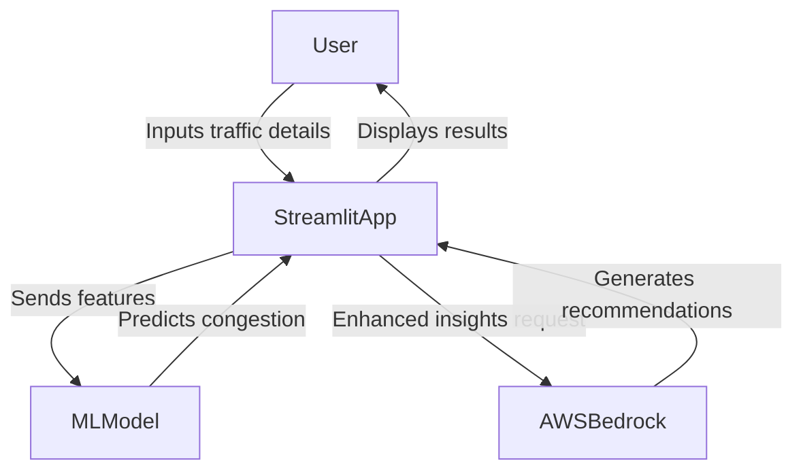

# Traffic-Congestion-Predictor
This project is designed to predict real-time traffic congestion levels using machine learning, interactive visualisations, and environmental factors.

# AI-Powered Traffic Congestion Predictor

Welcome to the **AI-powered Traffic Congestion Predictor** repository! This project is designed to predict real-time traffic congestion levels using machine learning, interactive visualizations, and environmental factors. The app is built with **Streamlit** and integrates model predictions for smarter urban planning and commute optimization.

## Features

- **Interactive Dashboard**: Predict traffic congestion levels based on real-time inputs.
- **24-Hour Congestion Forecast**: Line chart predictions for the next 24 hours.
- **Visual Insights**:
  - Gauge chart for current congestion.
  - Line chart for hourly congestion trends.
- **Traffic Recommendations**:
  - Alternative routes.
  - Optimal travel times.
  - Sustainable travel options.

## Project Architecture

This project consists of the following key components:

### Backend

- **Machine Learning Model**: Developed using a Jupyter Notebook.
  - The model predicts congestion levels based on:
    - Time of day (sin/cos transformations of hour and day).
    - Environmental conditions (temperature, precipitation).
    - Situational factors (special events, road work, vehicle count).
  - Scaling and feature engineering using `scikit-learn`.
  - Model persistence using `joblib`.

### Frontend

- **Streamlit Web App**: Interactive interface for:
  - User input (time, date, environmental conditions).
  - Visualisation of predictions (gauge charts, line charts).

## How to Use

1. **Clone the Repository**:
   ```bash
   git clone https://github.com/omar-steam/traffic-congestion-predictor.git
   cd traffic-congestion-predictor
   ```

2. **Install Dependencies**:
   ```bash
   pip install -r requirements.txt
   ```

3. **Run the App**:
   ```bash
   streamlit run app.py
   ```

4. **Upload the Pretrained Model**:
   Ensure `traffic_predictor_model.joblib` and `traffic_scaler.joblib` are placed in the root directory.

5. **Model Training (Optional)**:
   - Check the included Jupyter Notebook (`traffic_model_training.ipynb`) for model training details.

## AWS Bedrock Integration

### Architecture Workflow Diagram

Below is a conceptual workflow for extending this app with **AWS Bedrock** to integrate advanced large language models (LLMs) for enhanced traffic insights:



### Use Case with AWS Bedrock

- **Purpose**: Use LLMs for generating detailed traffic reports, natural language route descriptions, and congestion mitigation strategies.
- **Integration Points**:
  - Deploy the app on **AWS EC2**.
  - Use **AWS Lambda** to connect the app with Bedrock APIs for additional recommendations.

## Example Screenshots

### Dashboard:
- 

## Future Enhancements

- Integration with real-time traffic APIs (e.g., Google Maps, HERE Technologies).
- Mobile-friendly version.
- Deploy as a SaaS platform.

## Contributing

Contributions are welcome! Feel free to open an issue or submit a pull request.

## License

This project is licensed under the MIT License.
